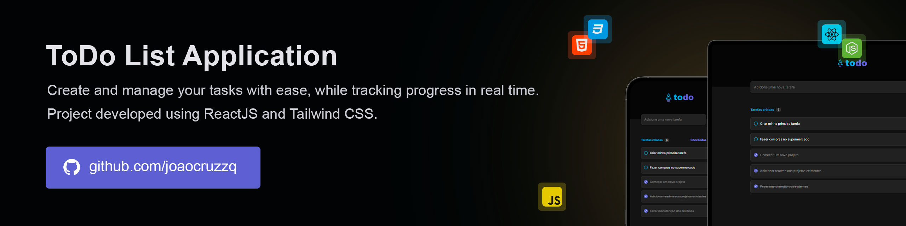

# ToDo List  

Simple task management application designed to help users organize their daily activities efficiently.

> 🔥 This project is built with pure web technologies, ensuring seamless cross-browser compatibility and minimal setup, without relying on external libraries or frameworks.



## Running

To run this project, clone the repository, install the dependencies, and start the application.

> Before running the project, ensure you have installed Node.js.

1. Clone the repository and open it's folder:
   ```sh
   git clone https://github.com/joaocruzzq/to-do-list.git
   cd to-do-list
   ```

2. Install dependencies and start the application:
   ```sh
   npm install
   npm run dev
   ```

## Features

> The **summary** of the features are listed below.

- it should be able to register a new task
- it should be able to remove an existing task
- it should be able to mark task as completed
- it should be able to show completion progress