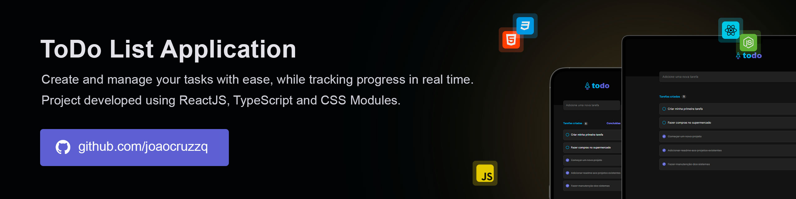

# ToDo List  

ToDo List is a user-friendly task management application designed to help users efficiently organize and track their daily activities. With a clean and intuitive interface, it allows users to easily create and manage tasks, ensuring that important goals are completed on time.

> 🔥 Built with the latest web technologies to ensure fast speed, high performance, and a seamless user experience. It leverages modern tools to deliver a responsive and intuitive interface across devices.



## Running

Follow these steps to run the project locally:

1. Clone the repository:
   ```sh
   git clone https://github.com/joaocruzzq/to-do-list.git
   cd to-do-list
   ```

2. Install dependencies:
   ```sh
   npm install
   ```

3. Run the application:
   ```
   npm run dev
   ```

> Note: Make sure you have <a href="https://nodejs.org/pt">Node.js</a> installed before starting.

## Features

> This application **should be able to**:

- register a new task to keep track of daily activities.
- remove an existing task to keep your to-do list up to date.
- mark tasks as completed to track your progress and stay motivated.
- view completion progress to easily monitor how many tasks have been finished.

## 🛠️ Technologies Used

| **Technology**        | **Description**                                                   | **Version** |
|-----------------------|-------------------------------------------------------------------|-------------|
| **React**             | A frontend library for building the user interface.              | 18.3.1      |
| **TypeScript**        | A typed superset of JavaScript that provides static types.        | 5.6.2       |
| **Vite**              | A fast build tool and development server.                         | 6.0.5       |
| **Phosphor React**    | A library for using Phosphor icons with React                     | 1.4.1      |
